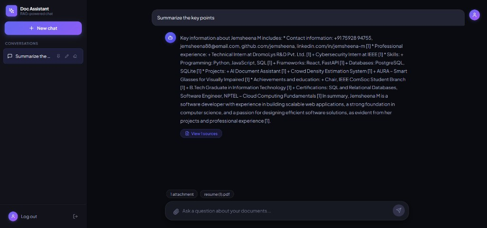
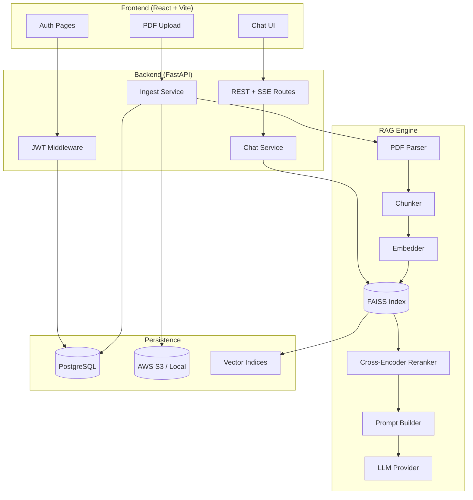
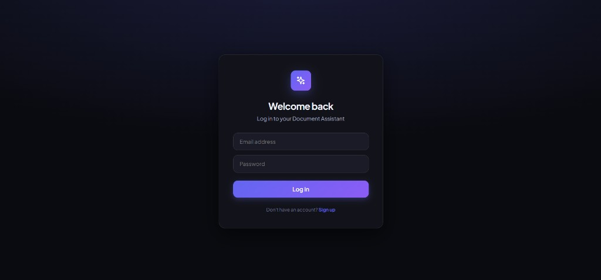
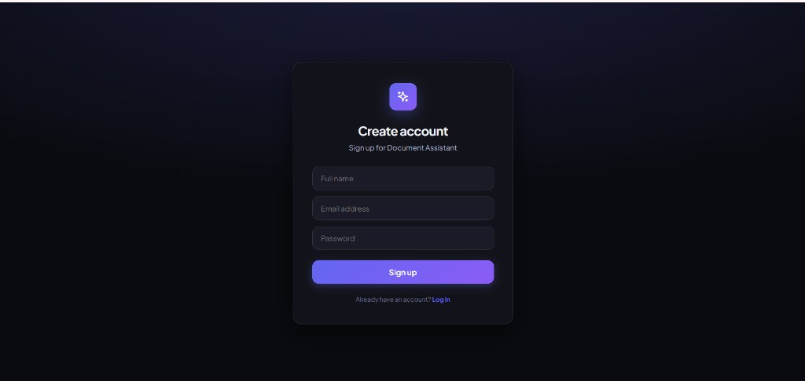
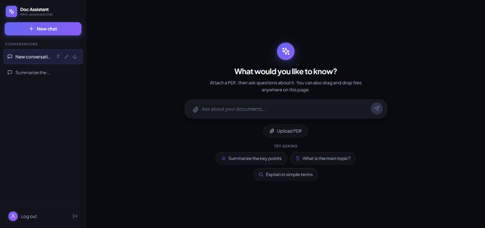
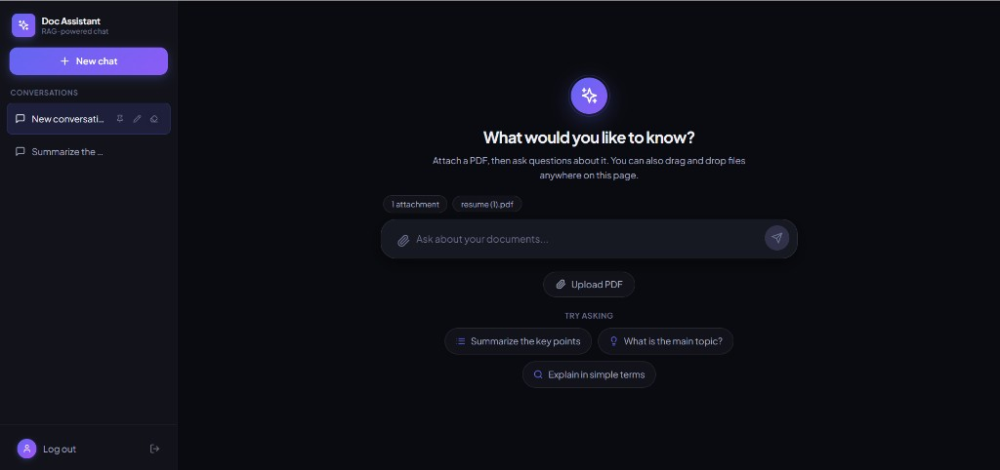
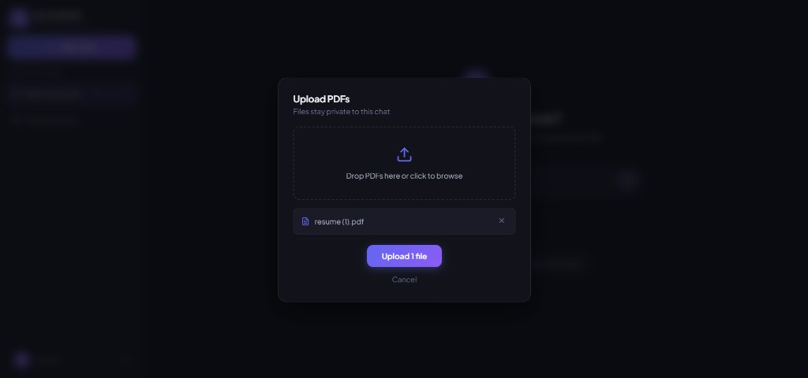

# Conversational Document Assistant

A production-ready **Retrieval-Augmented Generation (RAG)** platform for chatting with PDF documents. Upload corpora, ask natural-language questions, and receive **grounded answers with inline citations** and page-level source references — powered by FAISS vector search, cross-encoder reranking, and ultra-fast Groq inference.

[](https://github.com/jemsheena/Conversational-Document-Assistant/actions/workflows/ci-cd.yml)
[](LICENSE)
[](https://www.python.org/)
[](https://react.dev/)

<p align="center">
  
</p>

<p align="center"><em>Upload a PDF, ask a question, get a cited answer — powered by RAG.</em></p>

---

## Table of Contents

- [Overview](#overview)
- [Motivation](#motivation)
- [Key Features](#key-features)
- [Architecture](#architecture)
- [RAG Pipeline](#rag-pipeline)
- [Model Stack & Performance](#model-stack--performance)
- [Screenshots](#screenshots)
- [Quick Start](#quick-start)
- [Configuration](#configuration)
- [Optional Automation with n8n](#optional-automation-with-n8n)
- [API Reference](#api-reference)
- [Deployment](#deployment)
- [Project Structure](#project-structure)
- [Testing & Quality](#testing--quality)
- [Metrics & Observability](#metrics--observability)
- [Security](#security)
- [Current Implementation Status](#current-implementation-status)
- [Roadmap](#roadmap)
- [Documentation](#documentation)
- [License](#license)

---

## Overview

**Conversational Document Assistant** transforms static PDF knowledge bases into an interactive Q&A experience. Users authenticate, upload documents into collections, and converse with an AI that answers strictly from retrieved context — reducing hallucinations through citation binding and source validation.

The system is designed for:

- **Researchers & analysts** — query reports, papers, and manuals without manual search
- **Teams** — shared document collections with JWT-based access control
- **Developers** — pluggable LLM providers (Groq, OpenAI, Hugging Face, local Ollama) and Docker-first deployment

| Capability | Details |
|---|---|
| **Document types** | PDF (text extraction via PyMuPDF) |
| **Max upload size** | 50 MB per file |
| **Default LLM** | Groq `llama-3.3-70b-versatile` (128K context) |
| **Embedding model** | `sentence-transformers/all-MiniLM-L6-v2` (384-dim) |
| **Vector store** | FAISS (cosine similarity, per-collection indices) |
| **Database** | PostgreSQL 16 |
| **Storage** | Local disk (dev) or AWS S3 (production) |

---

## Motivation

Searching long PDFs by hand — reports, manuals, papers — is slow, and generic chatbots answer from memory rather than from the document in front of you, which invites hallucination. This project was built to explore how a **retrieval-grounded** chat experience can be made both accurate and fast: every answer is traced back to a specific page and passage, and the retrieval pipeline (embedding → FAISS search → cross-encoder reranking) was tuned to keep end-to-end latency in the low single-digit seconds even on CPU-only hardware. It also served as a practical exercise in building a full production-style stack — auth, streaming responses, CI/CD, and cloud deployment — around a non-trivial ML component rather than a toy CRUD app.

---

## Key Features

### Core RAG

- **Token-aware chunking** — 900-token chunks with 120-token overlap (tiktoken `cl100k_base`)
- **Hybrid retrieval** — FAISS top-K search (default K=12) + cross-encoder reranking (top-6)
- **Passage diversification** — limits per document/page to avoid redundant context
- **Citation enforcement** — inline `[1]`, `[2]` references with post-generation validation
- **Query caching** — 10-minute TTL on retrieval results for repeated queries

### Application

- **Streaming responses** — Server-Sent Events (SSE) for real-time token delivery
- **Source drawer** — document name, page number, relevance score, and snippet preview
- **Drag-and-drop upload** — batch PDF ingestion with progress feedback
- **Conversation management** — pin, rename, and clear chat history (client-side)
- **Configurable RAG params** — top-K, rerank-K, model, max tokens via Settings UI

### Infrastructure

- **Multi-provider LLM** — Groq (default), OpenAI, Hugging Face, local Ollama/LM Studio
- **JWT authentication** — access + refresh tokens, bcrypt password hashing
- **CI/CD pipeline** — lint → test → Docker build → GHCR push → EC2 deploy
- **Health checks** — `/health` endpoint for container orchestration

---

## Architecture



### Component Responsibilities

| Layer | Technology | Role |
|---|---|---|
| Frontend | React 18, Vite, Tailwind CSS | SPA with routing, auth state, SSE chat |
| API Gateway | FastAPI, Uvicorn | REST endpoints, streaming, CORS |
| Auth | python-jose, bcrypt | Registration, login, token refresh |
| ORM | SQLAlchemy 2.0, Alembic | Users, collections, documents, chats |
| Embeddings | Sentence-Transformers | Dense vector encoding (384-dim) |
| Vector DB | FAISS (IndexFlatIP) | Per-collection cosine similarity search |
| Reranker | Cross-Encoder MS MARCO MiniLM | Query-passage relevance rescoring |
| LLM | Groq / OpenAI / HF / Ollama | Grounded answer generation |
| Storage | boto3 / local filesystem | PDF blob persistence |
| Reverse Proxy | Nginx (frontend container) | Static assets + `/api` proxy |

---

## RAG Pipeline

The retrieval pipeline follows nine documented stages:

| Stage | Component | Description |
|---|---|---|
| 1 | **Ingest** | Accept PDF uploads, compute SHA-256 hash, store blob |
| 2 | **Parse** | Extract per-page text with PyMuPDF |
| 3 | **Chunk** | Split into 900-token segments with 120-token overlap |
| 4 | **Embed** | Encode chunks with MiniLM-L6-v2 (normalized vectors) |
| 5 | **Index & Retrieve** | FAISS search (K=12) → cross-encoder rerank (K=6) → diversify |
| 6 | **Prompt Build** | Inject numbered sources; truncate to 8K token budget |
| 7 | **Generate** | Stream LLM response with grounded system instructions |
| 8 | **Validate Citations** | Verify `[N]` references map to valid source indices |
| 9 | **Cache** | Store reranked passages (SHA-256 query hash, 600s TTL) |

### Default Hyperparameters

| Parameter | Default | Purpose |
|---|---|---|
| `DEFAULT_K` | 12 | Initial FAISS retrieval count |
| `DEFAULT_RERANK_K` | 6 | Passages sent to LLM after reranking |
| `DEFAULT_CHUNK_SIZE` | 900 | Max tokens per chunk |
| `DEFAULT_CHUNK_OVERLAP` | 120 | Overlap between adjacent chunks |
| `MAX_CONTEXT_TOKENS` | 8000 | Prompt context token budget |
| `MIN_RETRIEVAL_SCORE` | 0.1 | Minimum similarity threshold |
| `CACHE_TTL_SECONDS` | 600 | Retrieval cache lifetime |
| `CHAT_RATE_LIMIT` | 10 req/min | Per-user chat throttling |

---

## Model Stack & Performance

### Embedding Model — `all-MiniLM-L6-v2`

| Metric | Value |
|---|---|
| Dimensions | 384 |
| Parameters | ~22M |
| Max sequence length | 256 tokens |
| STS Benchmark (Spearman) | ~0.84 |
| Inference speed | ~3,000 sentences/sec (CPU) |

*Source: [Sentence-Transformers model card](https://huggingface.co/sentence-transformers/all-MiniLM-L6-v2)*

### Reranker — `cross-encoder/ms-marco-MiniLM-L-6-v2`

| Metric | Value |
|---|---|
| Parameters | ~22M |
| MS MARCO MRR@10 | ~0.387 |
| MS MARCO NDCG@10 | ~0.431 |
| Latency (CPU, batch=1) | ~15–25 ms per pair |

*Source: [Cross-Encoder MS MARCO model card](https://huggingface.co/cross-encoder/ms-marco-MiniLM-L-6-v2)*

### LLM Provider — Groq (Default)

| Model | Context | Avg Latency | Throughput | Best For |
|---|---|---|---|---|
| `llama-3.3-70b-versatile` | 128K | ~1.0s | 300–500 tok/s | **Production Q&A (recommended)** |
| `llama-3.1-70b-versatile` | 128K | ~1.2s | 250–400 tok/s | High-quality alternative |
| `mixtral-8x7b-32768` | 32K | ~0.5s | 500–800 tok/s | Lowest latency |
| `gemma2-9b-it` | 8K | ~0.3s | 600–900 tok/s | Lightweight queries |

### Provider Comparison

| Provider | Avg Response Time | Tokens/Second | Cost (per 1M tokens) |
|---|---|---|---|
| **Groq (Mixtral)** | ~0.5s | 500–800 | $0.05–0.27 |
| **Groq (Llama 3.3)** | ~1.0s | 300–500 | $0.05–0.27 |
| OpenAI GPT-4o-mini | ~2–3s | 80–120 | $0.15 in / $0.60 out |
| OpenAI GPT-4 | ~3–5s | 50–100 | $5.00 in / $15.00 out |
| Hugging Face (free) | ~10–30s | 10–30 | Free tier |

### End-to-End Latency (Typical)

| Phase | Duration (CPU, single query) |
|---|---|
| Embedding query | ~5–15 ms |
| FAISS search (K=12) | ~1–5 ms |
| Cross-encoder rerank (12 pairs) | ~150–300 ms |
| Prompt assembly | ~1–5 ms |
| LLM first token (Groq) | ~200–500 ms |
| Full response (600 tokens) | ~1–2s |
| **Total (retrieval → complete answer)** | **~1.5–3s** |

> **Note:** Latency varies with document corpus size, hardware, and LLM provider. Cached queries skip retrieval/reranking (~600s TTL).

### Citation Quality

The pipeline enforces grounded generation through:

1. System prompt requiring inline `[N]` citations
2. Post-generation regex validation of citation indices
3. Source metadata returned with every response (doc, page, score, snippet)

Expected behavior on well-indexed documents:

| Scenario | Expected Outcome |
|---|---|
| Answer in sources | Valid citations, accurate page references |
| Partial relevance | Answer with noted limitations |
| No relevant sources | Refusal message (no hallucinated facts) |

---

## Screenshots

### Authentication

Secure JWT-based login and registration with a modern dark UI.

<table>
  <tr>
    <td width="50%">
      
      <p align="center"><strong>Login</strong> — returning users sign in with email and password</p>
    </td>
    <td width="50%">
      
      <p align="center"><strong>Sign up</strong> — new users create an account with name, email, and password</p>
    </td>
  </tr>
</table>

### Chat Interface

The main workspace supports drag-and-drop PDF upload, suggested prompts, and multi-conversation management from the sidebar.

<p align="center">
  
</p>
<p align="center"><em>Empty state — attach a PDF and pick a suggested prompt to get started</em></p>

<p align="center">
  
</p>
<p align="center"><em>Document attached — <code>resume.pdf</code> indexed and ready for questions</em></p>

### PDF Upload

Batch upload via drag-and-drop or file browser. Files are indexed per chat session and stay private to the conversation.

<p align="center">
  
</p>

### Grounded Answers with Citations

Responses are generated strictly from retrieved document chunks. Inline `[1]` citations link back to source pages, and a **View sources** button exposes document name, page number, and relevance score.

<p align="center">
  
</p>

**Example query:** *"Summarize the key points"* on an uploaded resume PDF.

**Result:** Structured summary covering contact info, experience, skills, projects, education, and certifications — each claim backed by source `[1]`.

### UI Highlights

| Feature | Description |
|---|---|
| **Dark theme** | Modern purple-accented interface built with Tailwind CSS |
| **Conversation sidebar** | Pin, rename, and delete chats; quick switch between sessions |
| **Suggested prompts** | One-click starters: summarize, main topic, explain simply |
| **Attachment bar** | Shows indexed PDFs above the input field |
| **Streaming responses** | Real-time token delivery via Server-Sent Events |
| **Source citations** | Inline `[N]` references with expandable source drawer |

---

## Quick Start

### Prerequisites

- [Docker](https://docs.docker.com/get-docker/) & Docker Compose
- [Groq API key](https://console.groq.com/keys) (free tier available)

### 1. Clone and configure

```bash
git clone https://github.com/jemsheena/Conversational-Document-Assistant.git
cd Conversational-Document-Assistant
cp .env.example .env
```

Edit `.env` and set at minimum:

```env
GROQ_API_KEY=gsk_your_key_here
JWT_SECRET=your-secure-random-string
```

### 2. Start with Docker Compose

```bash
docker compose up -d
```

| Service | URL |
|---|---|
| Frontend | http://localhost |
| Backend API | http://localhost:8000 |
| API Docs (Swagger) | http://localhost:8000/docs |
| PostgreSQL | `localhost:5433` |

### 3. Use the application

1. Open http://localhost and **register** an account
2. **Upload PDFs** via drag-and-drop or the attachment button
3. **Ask questions** — answers stream in real time with source citations
4. Click **Sources** to inspect page references and relevance scores

### Local development (without Docker)

**Backend:**

```bash
cd backend
pip install torch --index-url https://download.pytorch.org/whl/cpu
pip install -r requirements.txt -r requirements-dev.txt
# Start PostgreSQL locally or via docker compose up postgres -d
python -m uvicorn app.main:app --reload --port 8000
```

**Frontend:**

```bash
cd frontend
npm install
npm run dev
# Opens at http://localhost:5173
```

---

## Optional Automation with n8n

If you want to trigger document ingestion from an external workflow or webhook, start the optional automation profile:

```bash
docker compose --profile automation up -d
```

This exposes n8n at http://localhost:5678. Import the workflow from [automation/n8n/ingest-notification-workflow.json](automation/n8n/ingest-notification-workflow.json) to forward uploads to the backend ingest endpoint, then notify Slack or another destination after the run completes.

Useful environment values for the automation stack include:

```env
BACKEND_URL=http://backend:8000
BACKEND_AUTH_TOKEN=your-token
SLACK_WEBHOOK_URL=https://hooks.slack.com/services/...
N8N_ENCRYPTION_KEY=change-me-in-production
```

---

## Configuration

All environment variables are documented in [`.env.example`](.env.example). Key sections:

### LLM Provider

```env
LLM_PROVIDER=groq          # groq | openai | huggingface | local
GROQ_API_KEY=gsk_...
GROQ_MODEL=llama-3.3-70b-versatile
```

See [GROQ_INTEGRATION.md](GROQ_INTEGRATION.md) for provider switching, model selection, and troubleshooting.

### Storage

```env
STORAGE_BACKEND=local      # local (dev) | s3 (production)
S3_BUCKET=your-bucket
AWS_REGION=eu-north-1
```

On EC2, attach an IAM role with S3 access — no access keys required in `.env`.

### RAG Tuning

```env
DEFAULT_K=12
DEFAULT_RERANK_K=6
DEFAULT_CHUNK_SIZE=900
DEFAULT_CHUNK_OVERLAP=120
MAX_CONTEXT_TOKENS=8000
CACHE_TTL_SECONDS=600
```

---

## API Reference

Interactive documentation: **http://localhost:8000/docs**

### Authentication

| Method | Endpoint | Description |
|---|---|---|
| `POST` | `/api/auth/register` | Create account (name, email, password) |
| `POST` | `/api/auth/login` | Obtain JWT access + refresh tokens |
| `POST` | `/api/auth/refresh` | Refresh access token |

### Documents & Search

| Method | Endpoint | Description |
|---|---|---|
| `POST` | `/api/ingest` | Upload PDFs to a collection (multipart) |
| `GET` | `/api/search` | Semantic search over a collection |
| `GET` | `/api/docs` | List indexed documents |

### Chat

| Method | Endpoint | Description |
|---|---|---|
| `POST` | `/api/chat` | Stream grounded answer (SSE) |

**Chat request body:**

```json
{
  "query": "What are the main findings?",
  "collection": "default",
  "k": 12,
  "rerank_k": 6,
  "model": "llama-3.3-70b-versatile",
  "max_tokens": 600
}
```

**SSE response events:**

```json
{"token": "The main findings...", "done": false}
{"done": true, "sources": [...], "citation_valid": true, "cited_sources": [1, 2]}
```

### Collections & Metrics

| Method | Endpoint | Description |
|---|---|---|
| `GET/POST` | `/api/collections` | Manage document collections |
| `GET` | `/api/metrics` | Aggregated `latency_ms`, `tokens`, and `retrieval_scores` stats |
| `GET` | `/health` | Service health check |

---

## Deployment

### Docker Compose (Development)

```bash
docker compose up -d
```

### Production (AWS EC2 + S3)

The project includes a full CI/CD pipeline:

```
Push to main → Lint → Test → Build Docker images → Push to GHCR → Deploy to EC2
```

**One-time EC2 setup:**

1. Install Docker and Docker Compose
2. Attach IAM role with `AmazonS3FullAccess`
3. Create `~/Conversational-Document-Assistant/.env` from `.env.example`
4. Set `STORAGE_BACKEND=s3` and `S3_BUCKET`

**GitHub secrets required:**

| Secret | Description |
|---|---|
| `EC2_HOST` | Instance IP (e.g. `13.61.13.161`) |
| `EC2_USER` | SSH user (e.g. `ec2-user`) |
| `EC2_SSH_KEY` | Full `.pem` file contents |

**Optional variable:** `EC2_DEPLOY_ENABLED=true`

Manual deploy fallback:

```bash
./deploy/scripts/deploy-ec2.sh <image-tag>
```

See [`.github/workflows/ci-cd.yml`](.github/workflows/ci-cd.yml) for the full pipeline definition.

### Container Images

| Image | Registry |
|---|---|
| Backend | `ghcr.io/jemsheena/conversational-document-assistant-backend` |
| Frontend | `ghcr.io/jemsheena/conversational-document-assistant-frontend` |

---

## Project Structure

```
Conversational-Document-Assistant/
├── backend/
│   ├── app/
│   │   ├── routes/          # API endpoints (auth, chat, ingest, search, …)
│   │   ├── dto/             # Pydantic request/response models
│   │   ├── models.py        # SQLAlchemy ORM models
│   │   ├── config.py        # Settings and defaults
│   │   └── main.py          # FastAPI application entry point
│   ├── rag/
│   │   ├── pdf.py           # PDF text extraction
│   │   ├── chunk.py         # Token-aware text splitting
│   │   ├── embed.py         # Sentence-Transformers / OpenAI embeddings
│   │   ├── store.py         # FAISS vector store
│   │   ├── rerank.py        # Cross-encoder reranking
│   │   ├── prompt.py        # Grounded prompt construction
│   │   ├── generate.py      # Multi-provider LLM streaming
│   │   ├── cache.py         # Query result caching
│   │   └── utils.py         # Diversification & citation validation
│   ├── alembic/             # Database migrations
│   ├── scripts/             # DB init & manual smoke-test scripts
│   ├── tests/               # Pytest suite
│   └── Dockerfile
├── frontend/
│   ├── src/
│   │   ├── pages/           # Chat, Auth, Settings, Collections, …
│   │   ├── components/      # Layout, Message, SourcesDrawer, …
│   │   └── store/           # React context (auth, chat state)
│   └── Dockerfile
├── deploy/
│   ├── scripts/             # EC2 deploy & verification scripts
│   ├── ecs-*.json           # ECS task/trust policy definitions
│   ├── deploy-aws.sh/.ps1   # AWS deploy helpers
│   └── *.ps1                # EC2 connection/upload helpers (Windows)
├── docs/
│   ├── architecture.md      # System architecture & diagrams
│   ├── design-decisions.md  # Key design decisions & rationale
│   ├── roadmap.md           # Planned work
│   ├── module-overview.md   # Per-module responsibilities
│   └── screenshots/         # Application UI screenshots (README)
├── .github/
│   ├── workflows/           # CI/CD pipelines
│   ├── ISSUE_TEMPLATE/      # Bug report & feature request templates
│   └── PULL_REQUEST_TEMPLATE.md
├── docker-compose.yml       # Local development stack
├── docker-compose.prod.yml  # Production EC2 stack
├── .env.example             # Environment template
├── CONTRIBUTING.md          # Contribution guidelines
├── CHANGELOG.md             # Version history
├── CODE_OF_CONDUCT.md       # Community standards
└── GROQ_INTEGRATION.md      # LLM provider guide
```

---

## Testing & Quality

### Backend

```bash
cd backend
pip install -r requirements.txt -r requirements-dev.txt
pytest tests/ -v
```

| Test | Coverage |
|---|---|
| `test_health.py` | Health endpoint returns 200 |
| `test_storage.py` | Local PDF save/load/delete |
| `test_chunk.py` | Token chunking boundaries, overlap, and edge cases |
| `test_store.py` | FAISS add/search round-trip, cosine ranking, collection isolation |
| `test_utils.py` | Citation validation and passage diversification |
| `test_chat.py` | SSE chat contract with mocked retrieval and LLM streaming |

### Frontend

```bash
cd frontend
npm run lint
npm run build
```

### CI Pipeline (on every PR and push to `main`)

1. **Lint Backend** — Ruff check + format
2. **Lint Frontend** — ESLint
3. **Test Backend** — Pytest with PostgreSQL service container
4. **Test Frontend** — Production build verification
5. **Build & Push** — Docker images to GHCR (main branch only)
6. **Deploy EC2** — Automated rollout (when enabled)

---

## Metrics & Observability

### Built-in Metrics Endpoint

`GET /api/metrics` returns aggregated statistics for:

- `latency_ms`: `mean`, `p95`, `count`
- `tokens`: `total_in`, `total_out`, `count`
- `retrieval_scores`: `mean`, `max`, `count`

Example response:

```json
{
  "latency_ms": {
    "mean": 245.3,
    "p95": 890.0,
    "count": 150
  },
  "tokens": {
    "total_in": 45000,
    "total_out": 12000,
    "count": 150
  },
  "retrieval_scores": {
    "mean": 0.72,
    "max": 0.95,
    "count": 150
  }
}
```

### Database Logging

The `retrieval_logs` table stores per-query metadata:

- Query text, retrieved/reranked passage IDs
- Latency (ms), model used, K and rerank-K values

### Application Logs

Structured logging for LLM requests:

```
⚡ Groq Request - Model: llama-3.3-70b-versatile
📝 Prompt length: 1234 chars (system) + 567 chars (user)
✅ Response completed successfully
```

---

## Security

| Control | Implementation |
|---|---|
| Authentication | JWT (HS256), 15-min access / 7-day refresh |
| Password storage | bcrypt hashing |
| CORS | Configurable origin whitelist |
| File validation | PDF-only uploads, 50 MB size limit |
| Secrets | Environment variables (never committed) |
| Production storage | S3 with IAM roles (no keys on EC2) |
| Rate limiting | 10 chat requests/minute (configurable) |

> **Important:** Change `JWT_SECRET` before any production deployment.

---

## Current Implementation Status

This is a working, self-hosted application, actively developed and deployable end-to-end. Status by area:

| Area | Status | Notes |
|---|---|---|
| PDF ingestion & parsing | ✅ Implemented | PyMuPDF text extraction, SHA-256 dedup |
| Chunking & embedding | ✅ Implemented | Token-aware chunking, MiniLM-L6-v2 |
| Vector search (FAISS) | ✅ Implemented | Per-collection `IndexFlatIP` |
| Cross-encoder reranking | ✅ Implemented | MS MARCO MiniLM reranker |
| Grounded generation + citations | ✅ Implemented | Streaming, citation validation |
| Multi-provider LLM support | ✅ Implemented | Groq, OpenAI, Hugging Face, Ollama |
| JWT auth | ✅ Implemented | Register/login/refresh, bcrypt hashing |
| Collections & document management | ✅ Implemented | REST endpoints, UI pages |
| Query result caching | ✅ Implemented | In-memory, 10-minute TTL |
| Metrics endpoint | ✅ Implemented | `latency_ms`, `tokens`, and `retrieval_scores` aggregates |
| CI pipeline (lint + test + build) | ✅ Implemented | GitHub Actions → GHCR |
| EC2/S3 deployment scripts | ✅ Implemented | Manual + CI-triggered rollout |
| Automated test coverage | ⚠️ Expanded | Health, storage, chunking, FAISS store, citation/diversification, and chat SSE; PDF parsing, embeddings, reranking, and ingest still need coverage |
| Persistent chat history (server-side) | ⚠️ Partial | Managed client-side; not yet persisted per-user in DB |
| Multi-tenant collection permissions | ⚠️ Basic | Owner-based access only, no sharing/roles |
| Non-PDF document support | ❌ Not implemented | PDF only |
| Horizontal scaling / distributed vector store | ❌ Not implemented | Single-node FAISS |

---

## Roadmap

Planned, not yet built:

- [ ] Extend automated test coverage to the remaining RAG surfaces (PDF parsing, embeddings, reranking, and ingest flows)
- [ ] Persist conversation history server-side, scoped per user
- [ ] Support additional document formats (DOCX, TXT, HTML)
- [ ] Add collection-level sharing and role-based access control
- [ ] Swap in a managed/distributed vector store (e.g. pgvector or Qdrant) as an alternative to local FAISS for multi-instance deployments
- [ ] Add integration tests for the CI pipeline against a real Postgres service container beyond current smoke tests

## Future Improvements

Ideas worth exploring beyond the current roadmap:

- Hybrid retrieval combining dense (FAISS) and sparse (BM25) search
- Streaming ingestion progress over SSE/WebSocket instead of polling
- Configurable retention/expiry policies for uploaded documents
- Prometheus/Grafana export for the existing `/api/metrics` data
- Per-collection embedding model selection

---

## Documentation

| Document | Description |
|---|---|
| [GROQ_INTEGRATION.md](GROQ_INTEGRATION.md) | Groq setup, model selection, provider switching |
| [`.env.example`](.env.example) | Full environment variable reference |
| [FastAPI /docs](http://localhost:8000/docs) | Interactive API documentation |

---

## License

This project is licensed under the [MIT License](LICENSE).

Copyright (c) 2025 Jemsheena M

---

## Acknowledgments

- [Groq](https://groq.com/) — ultra-fast LLM inference
- [Sentence-Transformers](https://www.sbert.net/) — embedding and cross-encoder models
- [FAISS](https://github.com/facebookresearch/faiss) — efficient similarity search
- [FastAPI](https://fastapi.tiangolo.com/) — modern Python API framework
