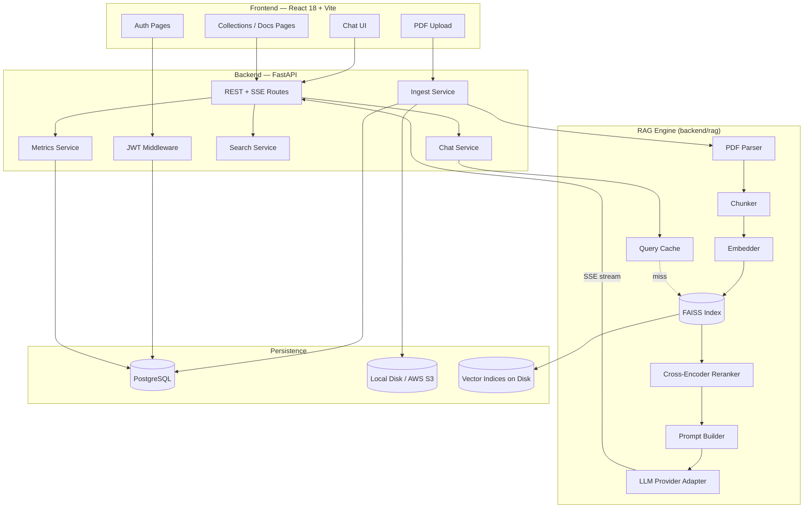
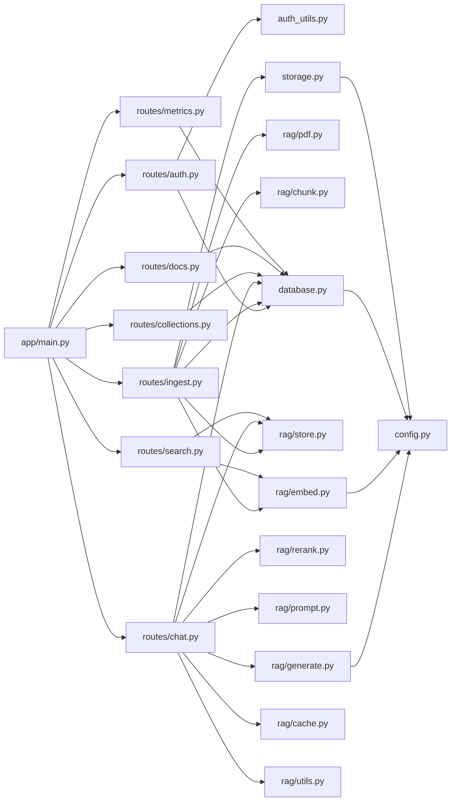
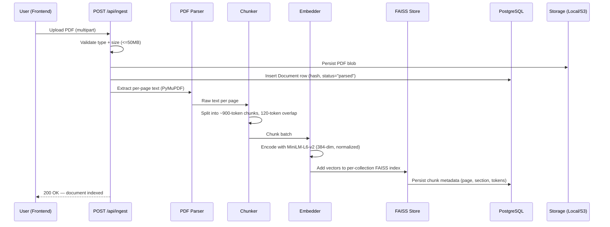
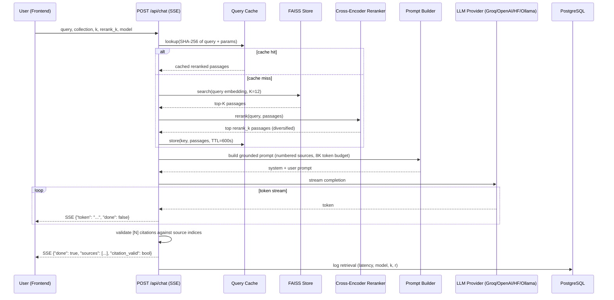
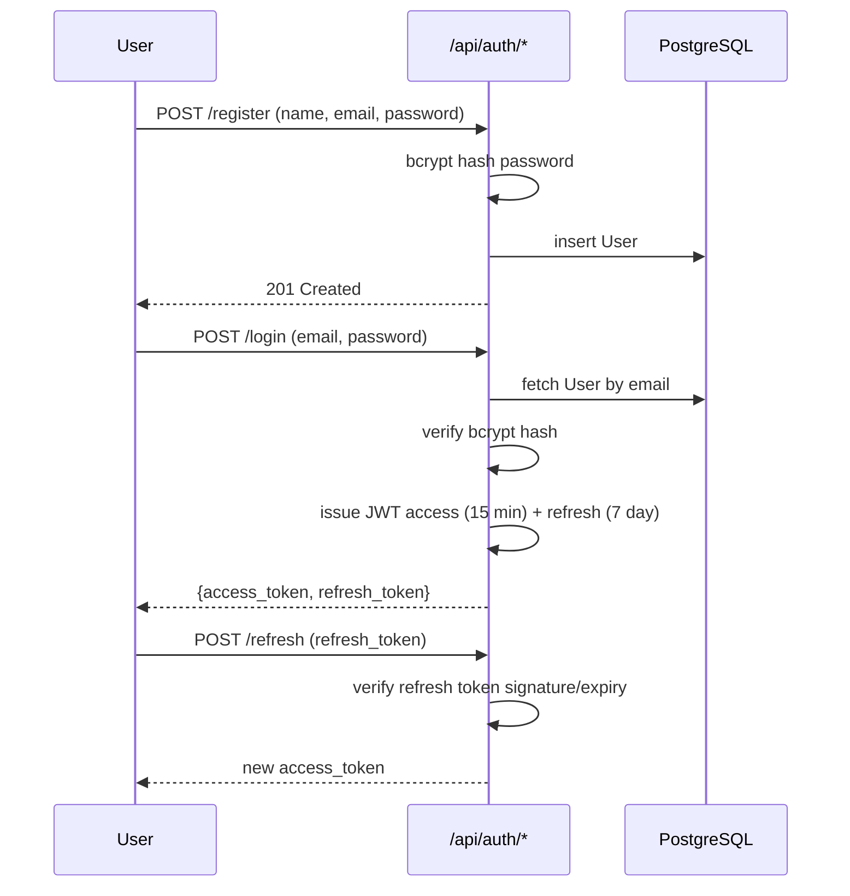
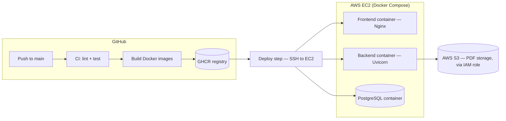

# Architecture

This document describes the system architecture of the Conversational Document Assistant as it is actually implemented — a monolithic FastAPI backend, a React SPA frontend, and a Retrieval-Augmented Generation (RAG) pipeline built around FAISS and a pluggable LLM provider layer.

> **Note on scope:** this project does not use event sourcing, CQRS, sagas, or a message broker (Kafka). It is a synchronous request/response web application with a streaming (SSE) chat endpoint. The diagrams below reflect the pipeline and data-flow patterns that *are* present: a request/response API, a multi-stage retrieval pipeline, and an ingestion pipeline.

## 1. Overall Architecture

**Key characteristics:**

- **Monolithic backend** — a single FastAPI service exposes all routes (`auth`, `collections`, `ingest`, `chat`, `search`, `docs`, `metrics`). There are no separate microservices.
- **Stateless API, stateful storage** — the API itself holds no session state beyond an in-process query cache; durable state lives in PostgreSQL (metadata) and on disk/S3 (PDF blobs, FAISS indices).
- **Streaming responses** — the `/api/chat` endpoint streams tokens to the client via Server-Sent Events rather than blocking for the full LLM response.

## 2. Module Dependencies

The `rag/` package has no dependency on `app/routes/` — it is pure pipeline logic invoked *by* the routes, which keeps the retrieval/generation code testable and provider-agnostic.

## 3. Document Ingestion Flow

## 4. Chat / Retrieval Flow (RAG Pipeline)

## 5. Authentication Flow

## Deployment View

---

Not every request path is diagrammed above (e.g. collections CRUD, metrics aggregation) since they are straightforward CRUD/read operations against PostgreSQL with no additional pipeline logic worth visualizing.
